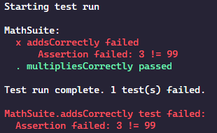

# AutoHotUnit - A unit testing framework for AutoHotkey

While there have been other unit testing frameworks for AutoHotkey, I found most
of them a bit clumsy to work with. This is my attempt to modernize the 
way AutoHotkey unit testing is done.

## Features

- Outputs colorized results to the command line
- Natural way of organizing tests and test suites with classes
- Full access to test lifecycle events: `beforeAll`, `beforeEach`, `afterEach`, `afterAll`.
- Provides a proper exit code, making it suitable for use in a CI environment like GitHub actions
- An easy-to-understand assertion library
- An extensible reporter API, allowing custom reporters for alternate formats (e.g. jUnit XML, notify, etc.)

## Installation

The recommended approach for installation is to use [ahkpm][].

To get the latest version of AutoHotUnit (which requires AutoHotkey 2):

`ahkpm install gh:joshuacc/AutoHotUnit`

To get previous versions, which supports AutoHotkey 1:

`ahkpm install gh:joshuacc/AutoHotUnit@1`

## Usage

A complete usage guide can be found below. For a working example, see the
`example` directory.

### Create the test entry point

Create a file named `tests.ahk` in your project directory.

```autohotkey
; Include AutoHotUnit. The path may be different on your system.
#Include, %A_ScriptDir%\ahkpm-modules\github.com\joshuacc\AutoHotUnit\AutoHotUnit.ahk

; Include each test file
; See individual test files for more information
#Include, %A_ScriptDir%\math.test.ahk

; Run all test suites
ahu.RunSuites()

; To execute all tests from the command line, use the following command:
; autohotkey tests.ahk | echo
; The echo is required in order to print output to the terminal.
```


### Defining test suites

Create a new file containing one or more test suites. I recommend naming it 
`*.test.ahk`

```autohotkey
; Include the file whose functionality you are testing
#Include, %A_ScriptDir%\math.ahk

; Register the test suite with AutoHotUnit
ahu.RegisterSuite(MathSuite)

; Define your test suite, extending from the AutoHotUnitSuite class
class MathSuite extends AutoHotUnitSuite {
    multipliesCorrectly() {
        this.assert.equal(Multiply(5, 3), 15)
    }

    addsCorrectly() {
        this.assert.equal(Add(1, 2), 3)
    }
}
```

### Running the tests

At the command line run `autohotkey tests.ahk | echo`. Piping to `echo` is
needed so AutoHotkey knows we want the output to show up on the command line.

Each method in your suite will be executed. If the results match the assertions,
then you will see green in your terminal. If not, you will see red. For example:



### Using assertions

Each AutoHotUnit test suite has access to `this.assert`, which provides several
types of assertions you can use to describe expected behavior in your test
suite. And the available assertions will be expanded in the future.

The current list:

- `equal(actual, expected)`
- `notEqual(actual, expected)`
- `isTrue(actual)`
- `isFalse(actual)`
- `isEmpty(actual)`
- `notEmpty(actual)`
- `fail(message)`
- `isAbove(actual, expected)`
- `isAtLeast(actual, expected)`
- `isBelow(actual, expected)`
- `isAtMost(actual, expected)`

### Suite lifecycle methods

Each AutoHotUnit test suite supports four lifecycle methods:

- `beforeAll`: Executed once per suite before any tests or other lifecycle methods. Suitable for per-suite setup.
- `beforeEach`: Executed once before each test. Suitable for per-test setup.
- `afterEach`: Executed once after each test. Suitable for per-test cleanup.
- `afterAll`: Executed once per suite after all tests and other lifecycle methods. Suitable for per-suite cleanup.


```autohotkey
class MathSuite extends AutoHotUnitSuite {
    beforeAll() {
        ; Overall suite setup goes here
    }
    
    beforeEach() {
        ; Per-test setup goes here
    }

    afterEach() {
        ; Per-test cleanup goes here
    }

    afterAll() {
        ; Overall suite cleanup goes here
    }

    multipliesCorrectly() {
        this.assert.equal(Multiply(5, 3), 15)
    }

    addsCorrectly() {
        this.assert.equal(Add(1, 2), 3)
    }
}
```

### Defining helper methods for your suite

AutoHotUnit also provides a way for you to define helper methods on your class
which will not be executed as tests. To add a helper method, just add a method
as normal, but prefix it with an underscore.

```autohotkey
class MathSuite extends AutoHotUnitSuite {
    _getRandomNumber() {
        ; This method will be skipped by AutoHotUnit, but is still available
        ; for you to use as needed within your test suite
    }

    multipliesCorrectly() {
        this.assert.equal(Multiply(5, 3), 15)
    }
}
```


[ahkpm]:https://ahkpm.dev
